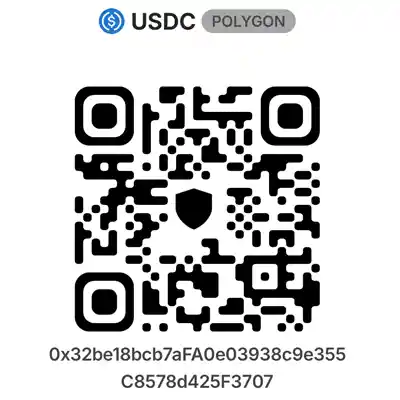
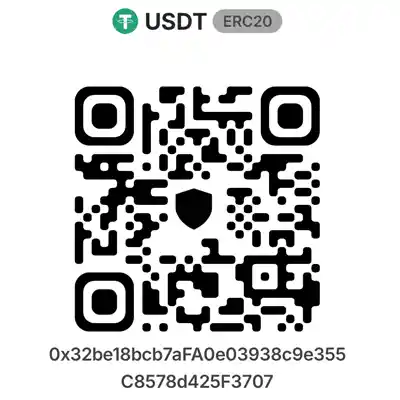
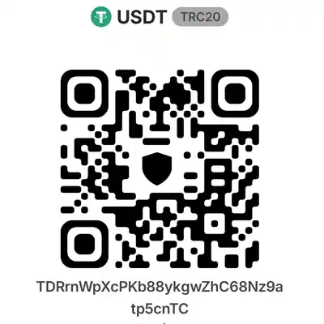
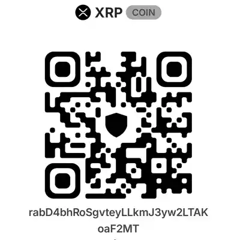

# Polymarket Lens

A read-only desktop viewer for public Polymarket data. It runs entirely on your
own machine, stores what it fetches in a local SQLite file, and never touches a
wallet, a private key, or an API key.

**Version 0.6.1** · Tested on Windows 11 · Python 3.10+ · no dependencies

---

## What it is

Polymarket publishes market data through public HTTP APIs. This tool reads those
APIs, keeps a local copy, and presents the parts that are awkward to compare on
the website: execution cost, how a price has actually moved, and how one market
compares against several hundred others.

It answers questions like:

- Which active markets have the tightest spreads right now?
- How much has this probability really moved in the past month, and when?
- Is this market thin enough that my own order would move the price?
- What did this market look like before today?

It deliberately does **not** answer "should I buy Yes or No." There is no
forecast, no signal, and no recommendation anywhere in the code.

## What it is not

- Not a trading client. It cannot place, cancel, or sign anything.
- Not connected to a wallet. There is no key handling of any kind.
- Not a predictor. Every number shown is an observation, not an estimate.
- Not affiliated with Polymarket.

## Features

**Market list**

- Search across question text, description, and slug
- Sort by volume, liquidity, end date, or tightest spread
- Hide thin markets below a liquidity floor
- Falls back to Polymarket's public search when a keyword is not in the local
  database, then saves what it finds

**Price chart**

- 1D / 1W / 1M / MAX ranges, each fetched at its own resolution
- Plotted on real timestamps, so a gap in observation shows as a gap
- Labelled axes with tick marks snapped to day and hour boundaries
- Hover for the probability and time at any point
- Fixed 0–100% vertical axis, so a small move never looks like a large one

**Price movement**

Computed from stored history, with no extra API calls:

- Change over the selected range, and over the last 24 hours
- High and low, with the time each occurred
- Typical daily swing
- Largest single move and how long it took

**Market conditions**

Spread, liquidity, and cumulative volume combined into a plain-language read on
how expensive this market is to enter and leave. This describes execution
quality, not profitability.

## Requirements

- Python 3.10 or newer
- No third-party packages. The entire application runs on the standard library.

There is no `pip install` step, no virtual environment, no `requirements.txt`,
and no build tooling. Cloning and running is the whole setup.

**Platform**

Developed and tested on **Windows 11 only.** The code uses the standard library
and makes no operating-system-specific calls, so it is expected to run on macOS
and Linux as well — but that has not been verified, and problems there are not
something the author can reproduce. The `.bat` launchers are Windows-only; on
other systems, use the commands below.

## Running it

**Windows**

Double-click `start_app.bat`. On the first run it downloads market data, then
opens your browser at `http://127.0.0.1:8765`. Press `Ctrl+C` in the console
window to stop it. Double-click `sync_data.bat` to refresh the data later.

**macOS and Linux** *(untested — see Platform above)*

```bash
python -m polymarket_app sync --markets 50
python -m polymarket_app serve
```

Then open `http://127.0.0.1:8765`. These commands work on Windows too, if you
would rather not use the `.bat` files.

### Commands

| Command | Options | Description |
|---|---|---|
| `init` | — | Create the database. Existing data is preserved. |
| `sync` | `--markets N` | Number of markets to fetch. Default 25. |
| | `--histories N` | Cap on markets to pull history for. Default: all. |
| `stats` | — | Stored market, outcome, and price-point counts. |
| `serve` | `--port N` | Listening port. Default 8765. |
| | `--host H` | Default `127.0.0.1`, reachable only from this machine. |
| *(all)* | `--db PATH` | Database location. Default `data/polymarket.db`. |

### Display requirement

The interface needs a window of at least **960 × 540 pixels**. Below that it
shows a notice instead of the layout. Phones are not supported.

## Tests

```bash
python -m unittest discover
```

53 tests, all offline. They read saved API samples from `docs/` and never make
a network request.

## Documentation

- [`docs/ARCHITECTURE.md`](docs/ARCHITECTURE.md) — how the application is built
- [Usage guide](https://jaykato.github.io/polymarket-lens/how_to_start.html) — illustrated, step by step
- [`docs/phase1_design.md`](docs/phase1_design.md) — design notes
- [`docs/api_verification.md`](docs/api_verification.md) — API findings
- [`DISCLAIMER.md`](DISCLAIMER.md) — risk, liability, and jurisdiction

## Safety boundaries

These are enforced in the code, not just promised here:

- Only `GET` requests are ever issued.
- Order creation and cancellation endpoints are not implemented.
- There are no configuration fields for keys, wallets, or credentials.
- The server binds to `127.0.0.1` by default.
- Query strings never reach SQL directly; sort keys resolve through a fixed
  table and unknown values fall back to a default.

## Feedback

Pull requests are not accepted.

Send any request via the [contact form](https://kenlabs.net/jkcontact/).

## License

See [`LICENSE.txt`](LICENSE.txt).

Use, copy, modification, and distribution are permitted for any purpose, free
of charge. Attribution is not required, and the author asks that you omit their
name entirely. The author's name may not be used to endorse or promote a
modified version, or to imply any involvement in it. Once modified or
redistributed, the software is yours alone.

The software is provided "as is", without warranty of any kind, and the author
accepts no liability.

## Support

This project is built and maintained by one person, in their own time. If it is
useful to you, you are welcome to contribute toward its continued development.
This is entirely optional, and nothing in the application depends on it.

Each address below sits in a code block, so you can copy it with the button that
appears at its right-hand edge.

**USDC · Polygon**



```text
0x32be18bcb7aFA0e03938c9e355C8578d425F3707
```

---

**USDT · Ethereum (ERC-20)**



```text
0x32be18bcb7aFA0e03938c9e355C8578d425F3707
```

---

**USDT · Tron (TRC-20)**



```text
TDRrnWpXcPKb88ykgwZhC68Nz9atp5cnTC
```

---

**XRP**

 <sub>no tag</sub>

```text
rabD4bhRoSgvteyLLkmJ3yw2LTAKoaF2MT
```

---

**Before sending**

- Send only on the network named above the address you copied. An asset sent on
  a different network is frequently unrecoverable.
- The Polygon and Ethereum addresses are identical. That is expected — both are
  EVM chains behind one key — but the network you send on still matters.
- The XRP address is a personal wallet. **No destination tag is required.**
- The text address is authoritative; the QR code is a convenience. If your
  wallet shows anything different after scanning, stop and use the text.

**Authenticity**

These addresses are only valid when read at
https://github.com/jaykato/polymarket-lens. Anyone may copy and modify this
project, and a copy hosted elsewhere may carry a different address.

Contributions are voluntary and non-refundable. They buy nothing, grant no
rights, create no obligation on the author, and do not entitle you to support,
features, or a reply.

---

このアプリは日本からの投資を勧誘するものではありません。Polymarket対象国の投資家・トレーダーが、マーケットの可視化を効率よくするツールです。日本からはPolymarketへ投資・トレードを行うことはできません。
